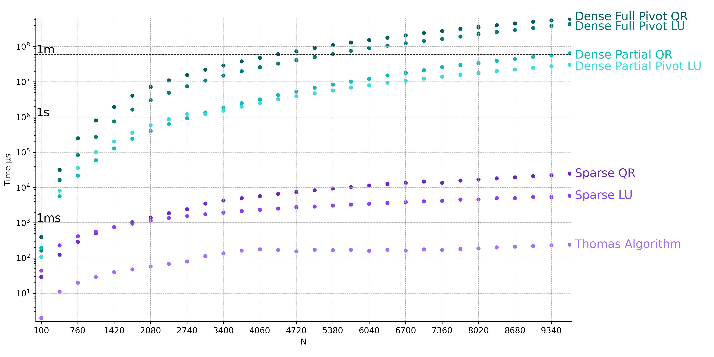
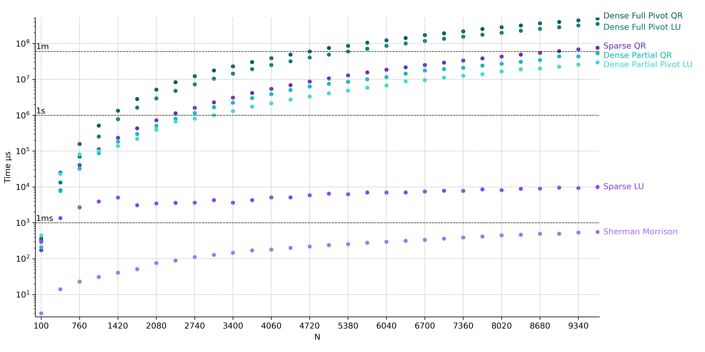
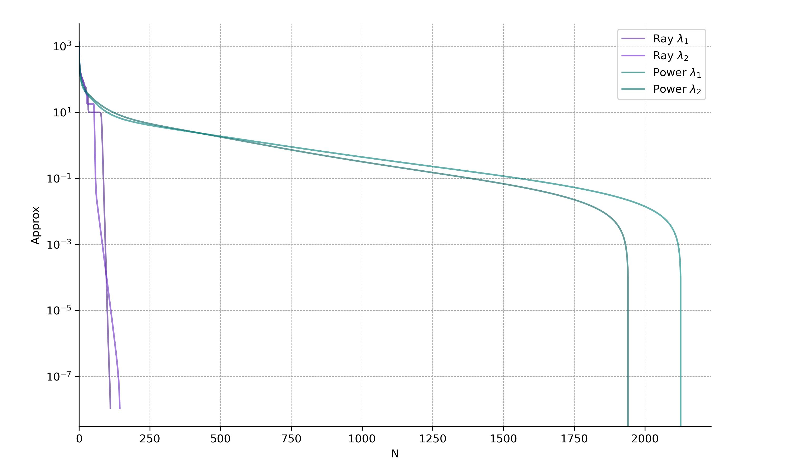
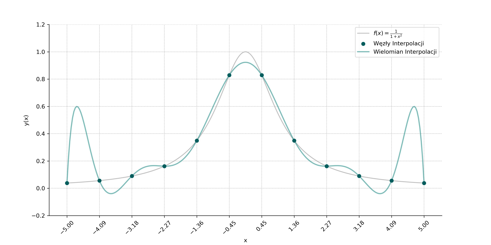
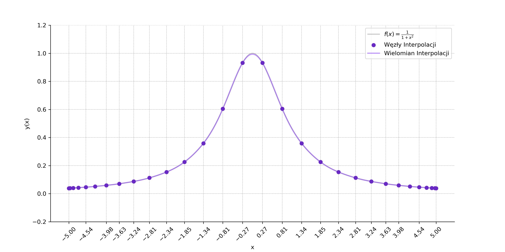
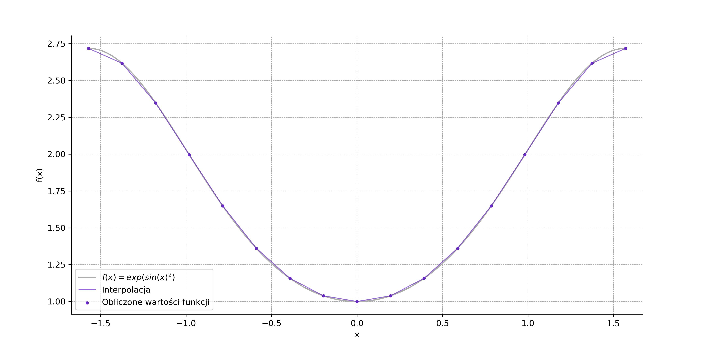

# Numerical methods | Jagiellonian university

**Winter semester 2025/2026**

## Tech

- **Language** C++23 with clang++ compiler
- **Linear Algebra Library** Eigen 5
- **Visualisations** Python (Pandas & Numpy & Matplotlib)
- **Typesetting** Typst (Reports)

## Project Structure

Codebase is documented in English but the formal reports are written in Polish. Each task (`N0X/`) follows a layout:

```text
.
├── src/                # C++ source code
├── scripts/            # Python scripts for data processing and chart generation
├── data/               # Raw output files (CSV) from simulations
├── figures/            # Generated plots
├── N0X_raport.pdf      # Compiled report (in Polish)
└── N0X_raport.typ      # Results analysis and theoretical background typestetting (in Polish)

```

## How to run?

Each task is separate. To run simulation:

1. Navigate to task directory (N0X)
2. Follow instructions in directory README.md

# Tasks

## [N01] Eigen decompositions and Thomas Algorithm ([Raport PDF](./N02/N02_raport.pdf))

Comparison and benchmarks of different methods for solving systems of equations with general Eigen methods and tailored solution for tridiagonal matrix. Program generates data for different matrix sizes and methods.

**Key insights:**: Confirmed that tailored solution (Thomas Algorithm) outperforms general sparse matix algorithms.



## [N02] Eigen decompositions and Thomas Algorithm with Sherman-Morrison Formula ([Raport PDF](./N02/N02_raport.pdf))

Comparison and benchmarks of different methods for solving systems of equations with general Eigen methods and tailored solution for tridiagonal matrix and Sherman-Morrison formula. Program generates data for different matrix sizes and methods.

**Key insights:**: Confirmed that tailored solution (Thomas Algorithm) with corectly used Sherman-Morrison formula outperforms general sparse matix algorithms.



## [N03] Eigenvalue Problem ([Raport PDF](./N03/N03_raport.pdf))

Program for finding biggest and smallest eigenvalues of a matrix. Comparison between Power method and Rayleigh method.

**Key insights:**: Observasions and implementation shows that more complicated Rayleigh iteration provides cubic convergence wiht good initial eigenvalue guess. Most of iterations were spent in normal Power method iteration to ensure correct convergence.

### Convergence plot



## [N04] Polynomial Interpolation & Runge Phenomenon ([Raport PDF](./N04/N04_raport.pdf))

Program for finding lagrange interpolation of a given function with minimal interpolation error. Shows comparison between equidistant nodes and Chebyshev nodes. Compares direct evaluation with evaluation from polynomial factors.

**Key insights:**: Succesfuly observed Runge Phenomenon (high degree polynomial oscilations at interval edges) and observed numerical instability in explicit calculations of interpolation polynomial coefficients, stopping minimalization of maximum interpolation error.

### Runge phenomenon plot



### Chebyshev interpolation plot



## [N05] Numerical Integration ([Raport PDF](./N05/N05_raport.pdf))

Numerical calculation of closed Newton-Cotes quadratures with different interpolation polynomials.

**Key insights:** Analyzed trade-off between degree of Newton-Cotes quadrature and numerical accuracy. Showed that simplest trapezoid method with iterative interval densyfing is most effective.



## [N06] Polynomial Root finding ([Raport PDF](./N06/N06_raport.pdf))

Program for finding all roots of polynomial with Laguerre method and smoothing.

**Key insights:** Laguerre method showed cubic convergence (O(N^3)) for single roots and linear convergence (O(N)) for multiple roots. Implemented effective polynomial deflation (smoothing) to enable finding of all polynomial roots wihtout accumulating numerical errors.

## [N07] Solving Non-Linear Systems ([Raport PDF](./N07/N07_raport.pdf))

Program solving multivariable systems of equations using damped multidimensional Newton method.

**Key insights:** Showed that Damped Newton Method provides greater convergence than standard Newton method, especialy for poor initial solution guesses.

# Author

**Jakub Kurek** Jagiellonian University, Faculty of Physics, Astronomy and Applied Computer Science (FAIS)
